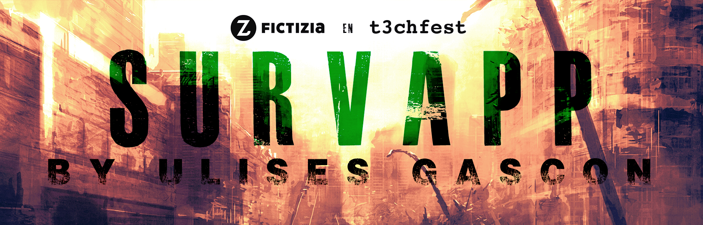

# Taller del T3chfest'19
### Desarrolla tu Survival Alert con Node.js



### Módulos 

- [`lib/air.js`](lib/air.js)
- [`lib/cameras.js`](lib/cameras.js)
- [`lib/earthquakes.js`](lib/earthquakes.js)
- [`lib/global.js`](lib/global.js)
- [`lib/maps.js`](lib/maps.js)
- [`lib/news.js`](lib/news.js)

### Usar los módulos

**Usar el módulo**
- Instalar dependencias `npm install`.
- Añade tus módulos a `node survapp`.
- Debes añadir tus tokens en `config.js`.
- Explorar la carpeta `/lib` y para entender el funcionamiento de todos los módulos.

**Dependencias**
- [Got](https://www.npmjs.com/package/got) *Got is a human-friendly and powerful HTTP request library.*
```js
const got = require('got');
 
(async () => {
    try {
        const response = await got('sindresorhus.com');
        console.log(response.body);
        //=> '<!doctype html> ...'
    } catch (error) {
        console.log(error.response.body);
        //=> 'Internal server error ...'
    }
})();
```

- [puppeteer](https://www.npmjs.com/package/puppeteer) *Puppeteer is a Node library which provides a high-level API to control Chrome or Chromium over the DevTools Protocol.*
```js
const puppeteer = require('puppeteer');
 
(async () => {
  const browser = await puppeteer.launch();
  const page = await browser.newPage();
  await page.goto('https://example.com');
  await page.screenshot({path: 'example.png'});
 
  await browser.close();
})();
```
