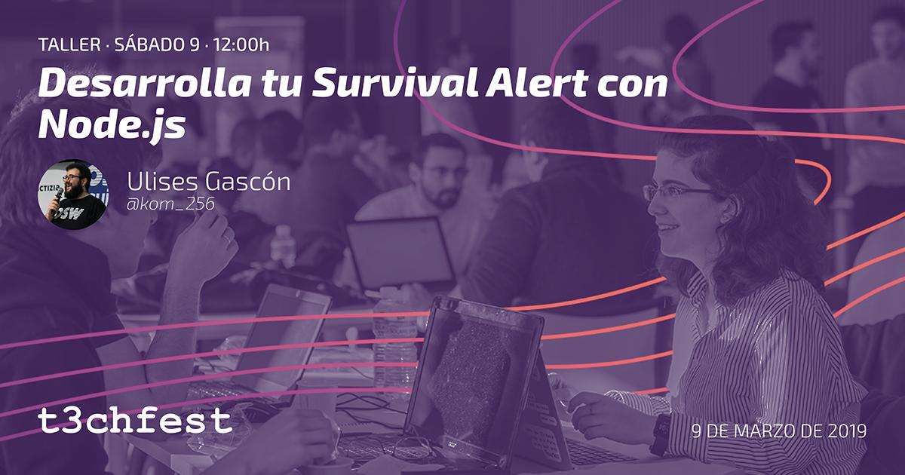
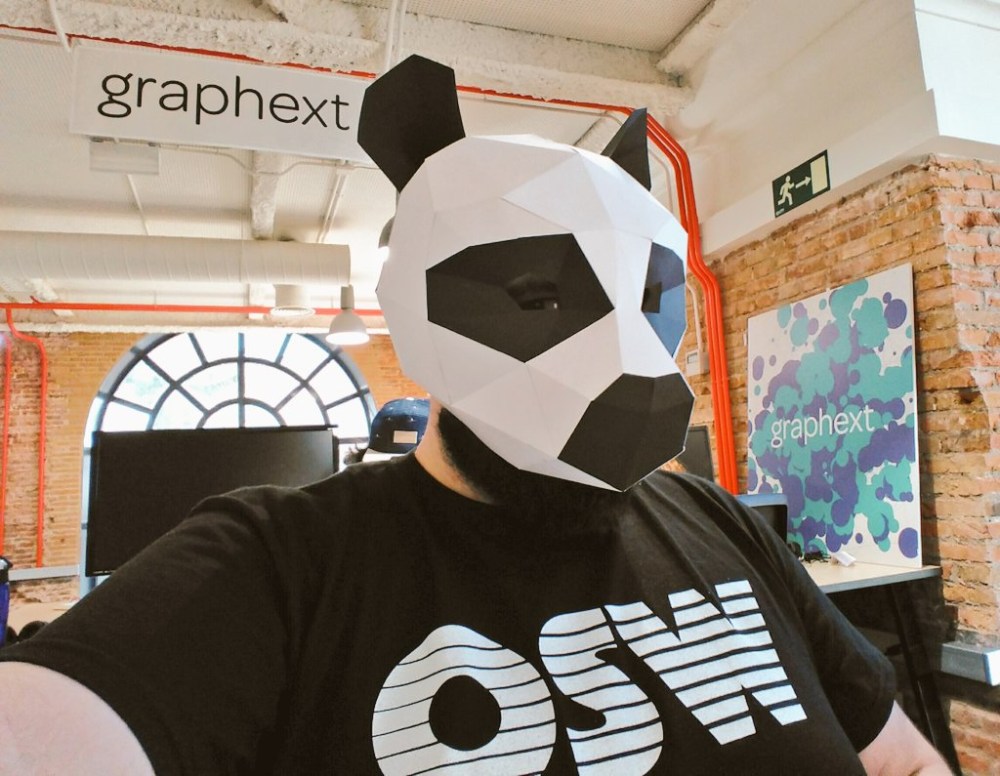

# Taller del T3chfest'19
### [Desarrolla tu Survival Alert con Node.js](https://t3chfest.uc3m.es/2019/learn-with-t3chfest/desarrolla-survival-alert-node-js/)

**Que el fin del mundo no te pille por sorpresa.**

Que el fin del mundo no te pille por sorpresa.

FICTIZIA y su profesor de tecnologías Javascript Ulises Gascón sacarán tu lado mas survivalista (¿mientras además huyes de los zombies?). Durante el taller veremos cómo usar Node.js y algunas de sus librerías para construir una aplicación donde enterarnos en tiempo real de los desastres que suceden en el mundo (terremotos, tsunamis, hambrunas, epidemias, cámaras de tráfico, noticias)…

Para centralizar toda esa información, procesaremos datos de diversas fuentes (APIs, Open Data, Scraping, RSS…) y daremos forma a todo para disponer de un bot de telegram y una herramienta CLI que nos avise de todo lo que sucede de una forma sencilla.

_Taller patrocinado por Fictizia._

**:metal: Sobre el ponente**

**Bio:**
Profesor de tecnologías JavaScript en FICTIZIA. Ulises es desarrollador Full Stack JavaScript especializado en Internet of Things con hardware libre como Arduino y Raspberry Pi y un colaborador activo en la comunidad de desarrollo de software libre, siendo además fundador de Open Source Weekends, la mayor comunidad sobre el mundo Open Source en España. Experto en el desarrollo de prototipos y productos con HTML5, JavaScript y Node.js. Ulises ha sido Technical Program Manager en Google y también es Ex-IBMer

**Redes Sociales:**
- [Twitter](https://twitter.com/kom_256)
- [Github](https://github.com/UlisesGascon)
- [Linkedin](https://www.linkedin.com/in/ulisesgascon/)
- [Twitch (live coding)](https://www.twitch.tv/ulisesgascon)

**:hourglass: Duración: 1h y 50 minutos**

### 🤔 ¿Qué haremos?

**:fire: Una herramienta CLI**

**:fire: Un bot de Telegram**

### :heart_eyes: ¿Cómo lo haremos?

**Tiempos (Fases)**
- `12:00 - 12:15` Intro al taller (15min)
- `12:15 - 12:25` Desarrollar el módulo de Terremotos (10min)
- `12:25 - 12:35` Analizar el resto de modulos (10min)
- `12:35 - 12:45` Aprendiendo [`Vorpal`](https://github.com/dthree/vorpal) (10min)
- `12:45 - 13:00` Desarrollar una CLI de terremotos con Vorpal (15min)
- `13:00 - 13:10` Analizar SurvAPP CLI (10min)
- `13:10 - 13:20` Aprendiendo [`Telegraf`](https://www.npmjs.com/package/telegraf) y mecánica de [Bots de Telegram](https://core.telegram.org/bots) (10min)
- `13:20 - 13:35` Desarrollar un Bot de terremotos para Telegram (15min)
- `13:35 - 13:45` Analizar SurvAPP BOT (10min)
- `13:45 - 13:50` Evolucionar SurvAPP (5min)
- `Extra` Dudas y preguntas

**Ramas**
- `master` *Solo información sobre el taller y las tecnologías*
- `equakes-module` *Módulo de terremotos aislado*
- `survapp-modules` *Todos los módulos de información*
- `equakes-cli` *Módulo de terremotos funcionando como CLI*
- `survapp-cli` *SurvAPP funcionando como CLI*
- `equakes-bot` *Módulo de terremotos funcionando como BOT de Telegram*
- `survapp-bot` *SurvAPP funcionando como BOT de Telegram*
- `survapp` *Versión final*

### :hourglass: Inputs relevantes (nuestros datos)

**Fuentes de datos**
- [Open Weather Map](https://openweathermap.org/) Información meteorologíca (UV, previsión ,etc...). Extracción via API
- [Datos Abietos Madrid | Tráfico. Cámaras](https://datos.madrid.es/portal/site/egob/menuitem.c05c1f754a33a9fbe4b2e4b284f1a5a0/?vgnextoid=8803c23866b93410VgnVCM1000000b205a0aRCRD&vgnextchannel=374512b9ace9f310VgnVCM100000171f5a0aRCRD&vgnextfmt=default) Imágenes de la ciudad. Extracción via datasets + ingeniería inversa
- [USGS | Earthquakes](https://earthquake.usgs.gov/earthquakes/) Información de terremotos. Extracción via HTTP 
- [Global Disaster Alert & Coordination System](http://www.gdacs.org/). Información sobre sequias, hambrunas, inundaciones, etc.. Extracción via SCRAPING 
- [Google Maps](https://developers.google.com/maps/documentation/maps-static/intro) Imágenes por satelite de mi ubicación. Extracción via API
- [News API](https://newsapi.org/) Noticias organizadas de +30k medios de todo el mundo. Extracción via API

### :scream: Dependencias

- [Nodejs `v8`](https://nodejs.org/es/)
- [Telegram Bots](https://core.telegram.org/bots)
- [got `v9.6.0`](https://www.npmjs.com/package/got)
- [puppeteer `v1.11.0`](https://www.npmjs.com/package/puppeteer)
- [telegraf `v3.27.0`](https://www.npmjs.com/package/telegraf)
- [terminal-image `v0.1.2`](https://www.npmjs.com/package/terminal-image)
- [vorpal `v1.12.0`](https://www.npmjs.com/package/vorpal)
- [Google Maps](https://cloud.google.com/maps-platform/?hl=es)
