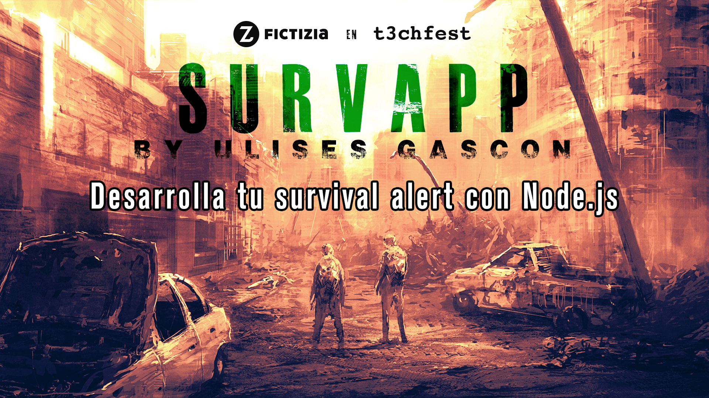

# Taller del T3chfest'19
### Desarrolla tu Survival Alert con Node.js

### Survapp 

**Survapp Bot de Telegram**

**Survapp CLI**

### Arrancar

**Usar el módulo**
- Instalar dependencias `npm install`.
- Debes añadir tus tokens en `config.js`.
- Ejecuta `node survapp.bot.js` para lanzar el Bot de Telegram.
- Ejecuta `node survapp.cli.js` para lanzar la herramienta de terminal

### Fuentes de datos
- [Open Weather Map](https://openweathermap.org/) Información meteorologíca (UV, previsión ,etc...). Extracción via API
- [Datos Abietos Madrid | Tráfico. Cámaras](https://datos.madrid.es/portal/site/egob/menuitem.c05c1f754a33a9fbe4b2e4b284f1a5a0/?vgnextoid=8803c23866b93410VgnVCM1000000b205a0aRCRD&vgnextchannel=374512b9ace9f310VgnVCM100000171f5a0aRCRD&vgnextfmt=default) Imágenes de la ciudad. Extracción via datasets + ingeniería inversa
- [USGS | Earthquakes](https://earthquake.usgs.gov/earthquakes/) Información de terremotos. Extracción via HTTP 
- [Global Disaster Alert & Coordination System](http://www.gdacs.org/). Información sobre sequias, hambrunas, inundaciones, etc.. Extracción via SCRAPING 
- [Google Maps](https://developers.google.com/maps/documentation/maps-static/intro) Imágenes por satelite de mi ubicación. Extracción via API
- [News API](https://newsapi.org/) Noticias organizadas de +30k medios de todo el mundo. Extracción via API

### Dependencias y estructura

**Módulos**
- [`lib/air.js`](lib/air.js)
- [`lib/cameras.js`](lib/cameras.js)
- [`lib/earthquakes.js`](lib/earthquakes.js)
- [`lib/global.js`](lib/global.js)
- [`lib/maps.js`](lib/maps.js)
- [`lib/news.js`](lib/news.js)

**Helpers** 
- [`helpers/telegram.js`](helpers/telegram.js)
- [`helpers/cli.js`](helpers/cli.js)

**Dependencias**
- [Nodejs `v8`](https://nodejs.org/es/)
- [Telegram Bots](https://core.telegram.org/bots)
- [got `v9.6.0`](https://www.npmjs.com/package/got)
- [puppeteer `v1.11.0`](https://www.npmjs.com/package/puppeteer)
- [telegraf `v3.27.0`](https://www.npmjs.com/package/telegraf)
- [terminal-image `v0.1.2`](https://www.npmjs.com/package/terminal-image)
- [vorpal `v1.12.0`](https://www.npmjs.com/package/vorpal)
- [Google Maps](https://cloud.google.com/maps-platform/?hl=es)
